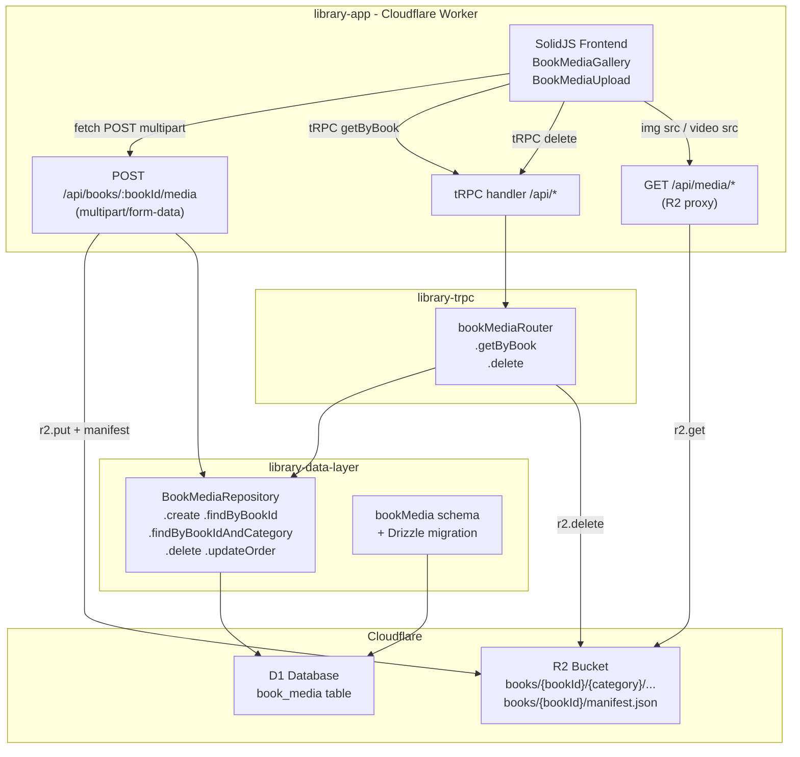
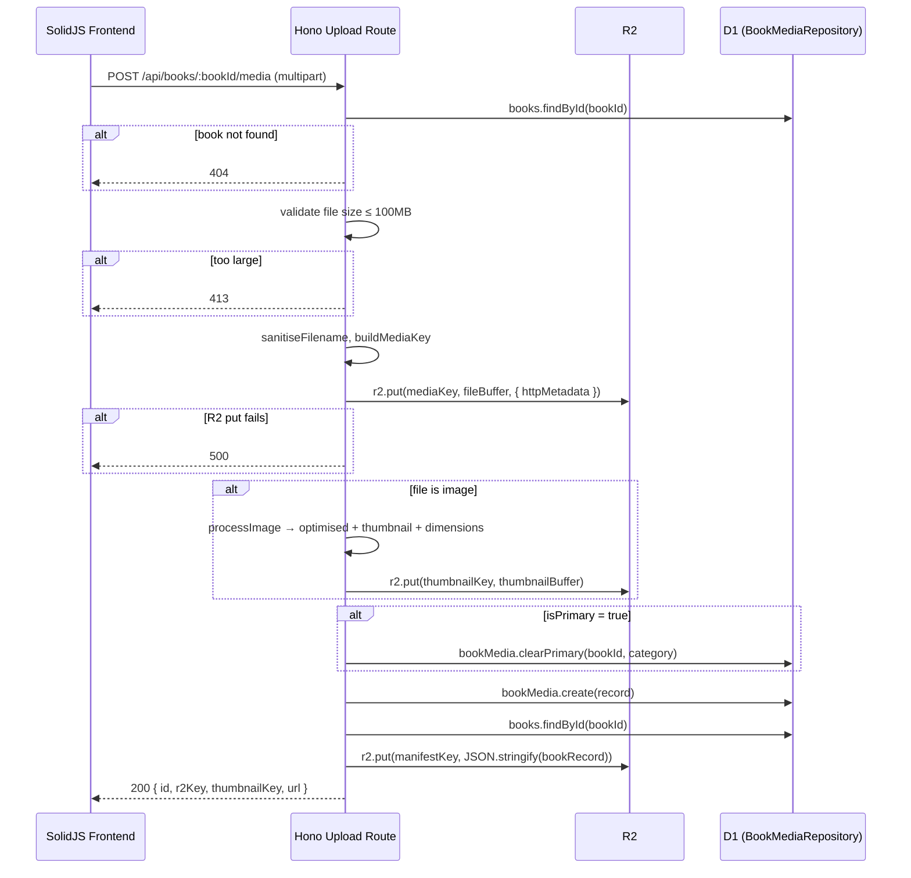
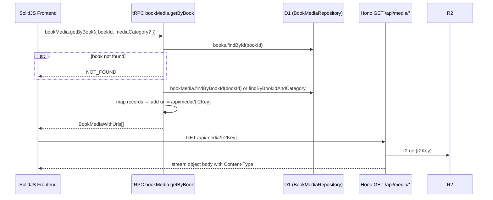
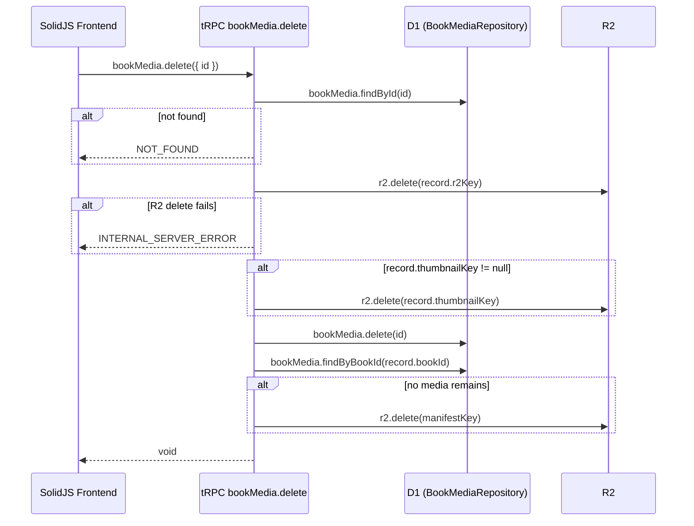

# Design Document: Book Media Support

## Overview

This feature adds media file support (images and videos) to the library application. Books can have associated media files stored in Cloudflare R2 object storage, with metadata persisted in a `book_media` D1 table. A JSON manifest file at `books/{bookId}/manifest.json` in R2 enables database reconstruction.

The feature spans three packages:
- `library-data-layer` — Drizzle schema, migration, `BookMediaRepository`
- `library-trpc` — `bookMediaRouter` with `getByBook` and `delete` procedures
- `library-app` — Hono multipart upload route, Worker proxy for media serving, SolidJS components

### Key Design Decisions

1. **Upload via Hono, not tRPC**: tRPC uses JSON serialisation, which cannot handle binary file payloads efficiently. The upload endpoint is a dedicated Hono route handling `multipart/form-data`. tRPC handles `getByBook` and `delete`.

2. **Media serving via Worker proxy, not signed URLs**: The R2 Workers binding does not expose `createSignedUrl`. Instead, a Hono route at `/api/media/:r2Key` streams objects directly from R2, acting as a proxy. This keeps media private while avoiding the S3-compatible API complexity.

3. **Image optimisation with `@jsquash`**: WASM-based libraries (`@jsquash/jpeg`, `@jsquash/png`, `@jsquash/resize`) run inside Cloudflare Workers for thumbnail generation and dimension extraction.

4. **R2 binding threaded through tRPC context**: The `tRPCContext` interface gains an optional `r2: R2Bucket` field. The `createContext` function in `library-app` reads the R2 binding from Hono's env and passes it through.

---

## Architecture



---

## Components and Interfaces

### 1. Hono Upload Route (`library-app`)

```
POST /api/books/:bookId/media
Content-Type: multipart/form-data

Fields:
  file         - File (required)
  mediaCategory - string (required): cover | back_cover | promotional | interview | event
  isPrimary    - string "true"|"false" (optional, default false)
  description  - string (optional)

Response 200: { id, r2Key, thumbnailKey?, url }
Response 400: { error: string }
Response 404: { error: "Book not found" }
Response 413: { error: "File too large" }
Response 500: { error: string }
```

### 2. Hono Media Proxy Route (`library-app`)

```
GET /api/media/*
  Streams the R2 object matching the key from the wildcard path segment.
  Sets Content-Type from R2 object httpMetadata.
  Returns 404 if object not found.
```

### 3. tRPC `bookMediaRouter` (`library-trpc`)

```typescript
bookMedia.getByBook({ bookId: number, mediaCategory?: string })
  → BookMediaWithUrls[]

bookMedia.delete({ id: number })
  → void
```

`BookMediaWithUrls` extends the DB record with:
- `url: string` — proxy URL `/api/media/{r2Key}`
- `thumbnailUrl: string | null` — proxy URL for thumbnail if present

### 4. `BookMediaRepository` (`library-data-layer`)

```typescript
class BookMediaRepository {
  create(data: NewBookMedia): Promise<BookMedia>
  findByBookId(bookId: number): Promise<BookMedia[]>           // ordered by displayOrder ASC
  findByBookIdAndCategory(bookId: number, category: string): Promise<BookMedia[]>
  findById(id: number): Promise<BookMedia | undefined>
  delete(id: number): Promise<boolean>
  updateOrder(id: number, displayOrder: number, isPrimary: boolean): Promise<BookMedia | undefined>
  clearPrimary(bookId: number, category: string): Promise<void>
}
```

### 5. Image Processing Utilities (`library-app`)

```typescript
// src/media/imageProcessor.ts
processImage(buffer: ArrayBuffer, mimeType: string): Promise<{
  optimised: ArrayBuffer,
  thumbnail: ArrayBuffer,
  width: number,
  height: number,
}>
```

Uses `@jsquash/jpeg`, `@jsquash/png`, `@jsquash/resize` for WASM-based processing inside the Worker.

### 6. Manifest Service (`library-app`)

```typescript
// src/media/manifest.ts
writeManifest(r2: R2Bucket, bookId: number, bookRecord: Book): Promise<void>
deleteManifest(r2: R2Bucket, bookId: number): Promise<void>
```

### 7. R2 Key Utilities (`library-app`)

```typescript
// src/media/r2Keys.ts
sanitiseFilename(name: string): string   // replace non-[a-zA-Z0-9._-] with _
buildMediaKey(bookId: number, category: string, timestamp: number, filename: string): string
buildThumbnailKey(bookId: number, category: string, timestamp: number, filename: string): string
buildManifestKey(bookId: number): string
```

---

## Data Models

### Drizzle Schema Addition (`library-data-layer/src/schema/index.ts`)

```typescript
import { index, uniqueIndex } from 'drizzle-orm/sqlite-core';

export const bookMedia = sqliteTable(
  'book_media',
  {
    id:            integer('id').primaryKey({ autoIncrement: true }),
    bookId:        integer('book_id').notNull().references(() => book.id, { onDelete: 'cascade' }),
    mediaType:     text('media_type', { length: 20 }).notNull(),      // 'image' | 'video'
    mediaCategory: text('media_category', { length: 30 }).notNull(),  // 'cover' | 'back_cover' | 'promotional' | 'interview' | 'event'
    r2Key:         text('r2_key', { length: 255 }).notNull(),
    fileName:      text('file_name', { length: 255 }).notNull(),
    fileSize:      integer('file_size'),
    mimeType:      text('mime_type', { length: 100 }),
    width:         integer('width'),
    height:        integer('height'),
    thumbnailKey:  text('thumbnail_key', { length: 255 }),
    displayOrder:  integer('display_order').default(0),
    isPrimary:     integer('is_primary', { mode: 'boolean' }).default(false),
    description:   text('description'),
    uploadedAt:    integer('uploaded_at', { mode: 'timestamp' }).notNull(),
    duration:      integer('duration'),
  },
  (t) => ({
    bookIdx:     index('book_media_book_idx').on(t.bookId),
    r2KeyIdx:    uniqueIndex('book_media_r2key_idx').on(t.r2Key),
    primaryIdx:  index('book_media_primary_idx').on(t.bookId, t.isPrimary),
  }),
);

export const bookMediaRelations = relations(bookMedia, ({ one }) => ({
  book: one(book, { fields: [bookMedia.bookId], references: [book.id] }),
}));
```

Relations on `book` must also be extended:
```typescript
// add to bookRelations
media: many(bookMedia),
```

### Migration File

New file: `packages/library-data-layer/drizzle/0001_book_media.sql`

```sql
CREATE TABLE `book_media` (
  `id` integer PRIMARY KEY AUTOINCREMENT NOT NULL,
  `book_id` integer NOT NULL,
  `media_type` text(20) NOT NULL,
  `media_category` text(30) NOT NULL,
  `r2_key` text(255) NOT NULL,
  `file_name` text(255) NOT NULL,
  `file_size` integer,
  `mime_type` text(100),
  `width` integer,
  `height` integer,
  `thumbnail_key` text(255),
  `display_order` integer DEFAULT 0,
  `is_primary` integer DEFAULT false,
  `description` text,
  `uploaded_at` integer NOT NULL,
  `duration` integer,
  FOREIGN KEY (`book_id`) REFERENCES `book`(`id`) ON UPDATE no action ON DELETE cascade
);
--> statement-breakpoint
CREATE INDEX `book_media_book_idx` ON `book_media` (`book_id`);
--> statement-breakpoint
CREATE UNIQUE INDEX `book_media_r2key_idx` ON `book_media` (`r2_key`);
--> statement-breakpoint
CREATE INDEX `book_media_primary_idx` ON `book_media` (`book_id`, `is_primary`);
```

After adding this file, run `bun run bundle-migrations` in `library-app` to regenerate `src/migrations.ts`.

### Schema Types Addition (`library-data-layer/src/schema/types.ts`)

```typescript
import { bookMedia } from './index';

export type BookMedia    = InferSelectModel<typeof bookMedia>;
export type NewBookMedia = InferInsertModel<typeof bookMedia>;

export type BookMediaWithUrls = BookMedia & {
  url: string;
  thumbnailUrl: string | null;
};
```

### `LibraryRepositories` Extension (`library-data-layer/src/index.ts`)

```typescript
import { BookMediaRepository } from './repositories';

export interface LibraryRepositories {
  // ...existing...
  bookMedia: BookMediaRepository;
}

export function createRepositories(db: DB): LibraryRepositories {
  return {
    // ...existing...
    bookMedia: new BookMediaRepository(db),
  };
}
```

---

## R2 Binding Configuration

### `wrangler.toml` changes

```toml
[[r2_buckets]]
binding = "MEDIA_BUCKET"
bucket_name = "library-media"
```

### `Env` interface (`library-app/src/context.ts`)

```typescript
import type { R2Bucket } from '@cloudflare/workers-types';

export interface Env {
  DB: D1Database;
  MEDIA_BUCKET: R2Bucket;
  ENVIRONMENT?: string;
}
```

### Hono `Bindings` type (`library-app/src/index.ts`)

```typescript
type Bindings = {
  DB: D1Database;
  MEDIA_BUCKET: R2Bucket;
  ENVIRONMENT?: string;
  ASSETS?: { fetch: typeof fetch };
};
```

### tRPC Context Extension (`library-trpc/src/trpc.ts`)

```typescript
import type { R2Bucket } from '@cloudflare/workers-types';

export interface tRPCContext {
  repositories: LibraryRepositories;
  env?: any;
  r2?: R2Bucket;
}
```

### `createContext` update (`library-app/src/context.ts`)

```typescript
export async function createContext(
  opts: FetchCreateContextFnOptions & { env: Env }
): Promise<tRPCContext & { req: Request; resHeaders: Headers; db: DB; env: Env }> {
  const db = initDB(opts.env.DB);
  const repositories = createRepositories(db);
  return {
    req: opts.req,
    resHeaders: opts.resHeaders,
    db,
    repositories,
    env: opts.env,
    r2: opts.env.MEDIA_BUCKET,   // ← new
  };
}
```

---

## Media Upload Flow



---

## Media Retrieval Flow



---

## Media Deletion Flow



---

## Frontend SolidJS Components

### `BookMediaGallery`

Location: `packages/library-app/src/frontend/components/BookMediaGallery.tsx`

Props:
```typescript
interface BookMediaGalleryProps {
  bookId: number;
  editMode?: boolean;
  onDeleted?: (id: number) => void;
}
```

Behaviour:
- Calls `trpc.bookMedia.getByBook.query({ bookId })` on mount
- Renders primary cover image prominently if present
- Renders thumbnail grid for remaining images
- Clicking a thumbnail opens a lightbox with the full-size `url`
- Renders `<video>` elements for video media using `url` as `src`
- Shows a placeholder when the media array is empty
- In `editMode`, shows a delete button per item that calls `trpc.bookMedia.delete.mutate`

### `BookMediaUpload`

Location: `packages/library-app/src/frontend/components/BookMediaUpload.tsx`

Props:
```typescript
interface BookMediaUploadProps {
  bookId: number;
  onUploaded?: () => void;
}
```

Behaviour:
- File input + category selector + optional description field
- Displays selected file name and size before submission
- On submit, POSTs `multipart/form-data` to `/api/books/{bookId}/media` (not via tRPC)
- Shows loading indicator during upload
- On success, calls `onUploaded()` to trigger gallery refresh
- On failure, displays error message from response body

---

## Manifest File Write/Delete Logic

The manifest is written/deleted by the Hono upload route and the tRPC delete procedure respectively.

**Write** (after every successful upload):
```typescript
const bookRecord = await ctx.repositories.books.findById(bookId);
const manifest = JSON.stringify({
  id: bookRecord.id,
  title: bookRecord.title,
  author: bookRecord.author,
  isbn: bookRecord.isbn,
  barcode: bookRecord.barcode,
  language: bookRecord.language,
  publisherId: bookRecord.publisherId,
});
await r2.put(`books/${bookId}/manifest.json`, manifest, {
  httpMetadata: { contentType: 'application/json' },
});
```

**Delete** (after last media record for a book is removed):
```typescript
const remaining = await ctx.repositories.bookMedia.findByBookId(bookId);
if (remaining.length === 0) {
  await r2.delete(`books/${bookId}/manifest.json`);
}
```

---

## Correctness Properties

*A property is a characteristic or behavior that should hold true across all valid executions of a system — essentially, a formal statement about what the system should do. Properties serve as the bridge between human-readable specifications and machine-verifiable correctness guarantees.*

### Property 1: Cascade delete removes media records

*For any* book that has associated `bookMedia` records, deleting the book from the `book` table should result in all corresponding `bookMedia` records being removed from the database.

**Validates: Requirements 1.2**

---

### Property 2: r2Key uniqueness constraint

*For any* two `bookMedia` records, attempting to insert a second record with the same `r2Key` as an existing record should fail with a constraint error, leaving the original record unchanged.

**Validates: Requirements 1.3**

---

### Property 3: Enum constraint enforcement

*For any* value of `mediaType` not in `{image, video}` or `mediaCategory` not in `{cover, back_cover, promotional, interview, event}`, attempting to insert a `bookMedia` record with that value should be rejected.

**Validates: Requirements 1.6, 1.7**

---

### Property 4: Insert then retrieve round-trip

*For any* valid `NewBookMedia` record, inserting it via `BookMediaRepository.create` and then calling `findByBookId` should return a list that includes a record with the same `r2Key`, `mediaType`, `mediaCategory`, and `fileName`.

**Validates: Requirements 2.1, 5.1**

---

### Property 5: findByBookId ordering invariant

*For any* book with multiple `bookMedia` records having distinct `displayOrder` values, `findByBookId` should return them in ascending order of `displayOrder`.

**Validates: Requirements 2.2, 6.1**

---

### Property 6: Category filter correctness

*For any* book and any `mediaCategory` value, `findByBookIdAndCategory` should return only records where both `bookId` and `mediaCategory` match the query parameters.

**Validates: Requirements 2.3, 6.2**

---

### Property 7: Delete returns correct boolean

*For any* existing `bookMedia` record, calling `delete(id)` should return `true` and a subsequent `findById(id)` should return `undefined`. For any `id` that does not exist, `delete(id)` should return `false`.

**Validates: Requirements 2.4**

---

### Property 8: FK constraint propagated on invalid bookId

*For any* `bookId` that does not correspond to a row in the `book` table, calling `BookMediaRepository.create` with that `bookId` should throw a database constraint error.

**Validates: Requirements 2.6**

---

### Property 9: R2 key format invariant

*For any* `bookId`, `mediaCategory`, `timestamp`, and filename string, `buildMediaKey` should produce a string matching the pattern `books/{bookId}/{mediaCategory}/{timestamp}-{sanitisedFilename}`, and `buildThumbnailKey` should produce `books/{bookId}/{mediaCategory}/{timestamp}-thumb-{sanitisedFilename}`.

**Validates: Requirements 3.1, 3.2**

---

### Property 10: Filename sanitisation character set

*For any* filename string, `sanitiseFilename` should return a string containing only characters from `[a-zA-Z0-9._-]`.

**Validates: Requirements 3.3**

---

### Property 11: Manifest written after upload

*For any* successful media upload for a book, the R2 object at `books/{bookId}/manifest.json` should exist and be parseable as a JSON object containing the fields `id`, `title`, `author`, `isbn`, `barcode`, `language`, and `publisherId`.

**Validates: Requirements 4.1, 4.2, 5.1**

---

### Property 12: Manifest round-trip

*For any* book with at least one `bookMedia` record, parsing the manifest JSON from R2, serialising the resulting object back to JSON, and parsing again should produce an object equivalent to the original (same field values for `id`, `title`, `author`, `isbn`, `barcode`, `language`, `publisherId`).

**Validates: Requirements 11.2, 11.3**

---

### Property 13: Manifest deleted when no media remains

*For any* book where all `bookMedia` records are deleted, the R2 object at `books/{bookId}/manifest.json` should no longer exist.

**Validates: Requirements 4.3**

---

### Property 14: Thumbnail generated for image uploads

*For any* image upload (MIME type starting with `image/`), after a successful upload the `bookMedia` record should have a non-null `thumbnailKey`, and the R2 object at that key should exist.

**Validates: Requirements 5.2**

---

### Property 15: Image dimensions recorded

*For any* image upload, the resulting `bookMedia` record should have non-null `width` and `height` values matching the actual pixel dimensions of the uploaded image.

**Validates: Requirements 5.3**

---

### Property 16: isPrimary exclusivity invariant

*For any* book and `mediaCategory`, after an upload with `isPrimary = true`, at most one `bookMedia` record for that `bookId` and `mediaCategory` combination should have `isPrimary = true`.

**Validates: Requirements 5.8**

---

### Property 17: URL fields present in retrieval response

*For any* `bookMedia` record returned by `getByBook`, the record should include a non-empty `url` string. For any record with a non-null `thumbnailKey`, the record should also include a non-empty `thumbnailUrl` string.

**Validates: Requirements 6.3, 6.4**

---

### Property 18: Upload atomicity — no DB record on R2 failure

*For any* upload request where the R2 `put` operation fails, no `bookMedia` record should be inserted into the database.

**Validates: Requirements 5.7**

---

### Property 19: Delete atomicity — no DB deletion on R2 failure

*For any* delete request where the R2 `delete` operation fails, the `bookMedia` record should remain in the database unchanged.

**Validates: Requirements 7.4**

---

### Property 20: Delete removes R2 objects

*For any* existing `bookMedia` record, after a successful delete operation the R2 object at `record.r2Key` should not exist, and if `record.thumbnailKey` was non-null, the R2 object at that key should also not exist.

**Validates: Requirements 7.1, 7.2**

---

## Error Handling

| Scenario | Layer | Response |
|---|---|---|
| Book not found on upload | Hono route | HTTP 404 |
| File exceeds 100 MB | Hono route | HTTP 413 |
| R2 put fails | Hono route | HTTP 500, no DB insert |
| Invalid multipart fields | Hono route | HTTP 400 |
| Book not found on getByBook | tRPC | `NOT_FOUND` |
| Media record not found on delete | tRPC | `NOT_FOUND` |
| R2 delete fails | tRPC | `INTERNAL_SERVER_ERROR`, no DB delete |
| Invalid tRPC input (Zod) | tRPC | `BAD_REQUEST` |
| R2 object not found on proxy | Hono proxy | HTTP 404 |
| DB constraint violation (duplicate r2Key) | Repository | propagated as 500 |

All errors are logged via the existing `layerLogger` / `honoLogger` infrastructure.

---

## Testing Strategy

### Unit Tests

Focus on pure functions and repository logic with a test D1 instance:

- `sanitiseFilename` — verify character replacement for various inputs
- `buildMediaKey` / `buildThumbnailKey` — verify key format
- `BookMediaRepository` — CRUD operations against a local D1 instance (Miniflare)
- Manifest JSON serialisation/deserialisation round-trip
- `isPrimary` clearing logic

### Property-Based Tests

Use **fast-check** (already available in the JS ecosystem, runs in Vitest) with a minimum of **100 iterations per property**.

Each test is tagged with a comment in the format:
`// Feature: book-media-support, Property {N}: {property_text}`

Properties to implement as property-based tests:

| Property | Test description |
|---|---|
| P1 | Generate random books with media, delete book, assert no orphan media rows |
| P2 | Generate random r2Keys, attempt duplicate insert, assert constraint error |
| P3 | Generate random enum values outside allowed sets, assert insert rejection |
| P4 | Generate random NewBookMedia, insert, findByBookId, assert record present |
| P5 | Generate N records with random displayOrder, assert returned order is ascending |
| P6 | Generate records across categories, filter by category, assert all match |
| P7 | Insert record, delete by id, assert returns true and record gone; delete non-existent id, assert false |
| P8 | Generate non-existent bookId, assert create throws |
| P9 | Generate random inputs, assert key matches regex pattern |
| P10 | Generate random filenames, assert sanitised output matches `[a-zA-Z0-9._-]+` |
| P11 | Simulate upload, assert manifest exists and contains required fields |
| P12 | Generate book records, serialise to manifest JSON, parse, re-serialise, parse, assert equivalence |
| P13 | Insert media, delete all, assert manifest gone |
| P14 | Simulate image upload, assert thumbnailKey non-null and R2 object exists |
| P15 | Upload image with known dimensions, assert width/height in record match |
| P16 | Upload multiple records with isPrimary=true for same book+category, assert only one isPrimary |
| P17 | Call getByBook, assert every record has non-empty url; records with thumbnailKey have thumbnailUrl |
| P18 | Simulate R2 failure on put, assert no DB record created |
| P19 | Simulate R2 failure on delete, assert DB record unchanged |
| P20 | Delete record, assert R2 objects at r2Key and thumbnailKey are gone |

### Integration Tests

- Full upload → retrieve → delete cycle via Hono + tRPC using Miniflare's R2 mock
- Verify manifest lifecycle across upload and delete operations
- Verify `ON DELETE CASCADE` via book deletion

### Property Test Configuration

```typescript
// vitest.config.ts — no changes needed, fast-check works with Vitest
// Each property test:
import fc from 'fast-check';

test('P10: filename sanitisation character set', () => {
  // Feature: book-media-support, Property 10: filename sanitisation character set
  fc.assert(
    fc.property(fc.string(), (filename) => {
      const result = sanitiseFilename(filename);
      return /^[a-zA-Z0-9._-]*$/.test(result);
    }),
    { numRuns: 100 }
  );
});
```
