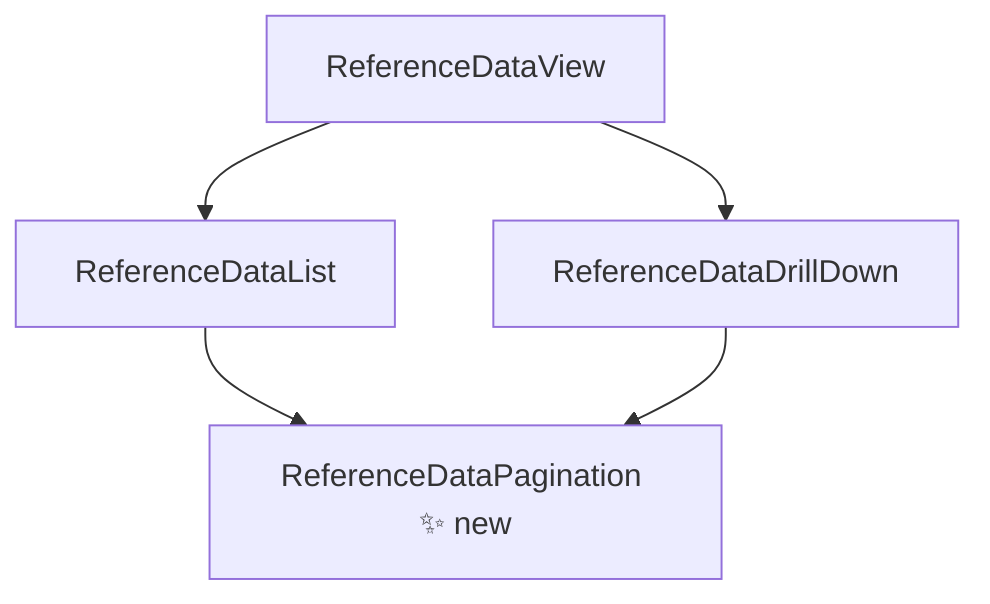

# Design Document

## Overview

This design covers the extraction of duplicated pagination controls from `ReferenceDataDrillDown` and `ReferenceDataList` into a single reusable SolidJS component: `ReferenceDataPagination`.

Both source components already render an identical pagination bar (Previous button, "Page X of Y" label, Next button) but compute `totalPages` differently:

- `ReferenceDataDrillDown` derives it from a remote resource's `total` count: `Math.ceil((drillData()?.total || 0) / pageSize) || 1`
- `ReferenceDataList` derives it from a client-side memo over a filtered array: `Math.ceil(filteredList().length / pageSize) || 1`

The new component accepts both patterns through a unified props interface using SolidJS `Accessor<number>` types, keeping reactivity intact without imposing a specific computation strategy on the caller.

## Architecture

The change is purely a UI-layer refactor within `packages/library-app/src/frontend/components/`. No backend, data layer, or routing changes are required.



The new file sits alongside the existing components:

```
src/frontend/components/
  ReferenceDataPagination.tsx   ← new
  ReferenceDataList.tsx         ← updated (inline pagination div replaced)
  ReferenceDataDrillDown.tsx    ← updated (inline pagination div replaced)
  ReferenceDataView.tsx         ← unchanged
```

## Components and Interfaces

### ReferenceDataPagination

**File:** `src/frontend/components/ReferenceDataPagination.tsx`

```typescript
import { Accessor } from 'solid-js';

interface ReferenceDataPaginationProps {
  page: Accessor<number>;        // zero-based current page index
  totalPages: Accessor<number>;  // total number of pages
  onPrevious: () => void;        // called when Previous is clicked
  onNext: () => void;            // called when Next is clicked
}
```

The component renders a single `div` matching the existing layout exactly:

- `display: flex`, `justify-content: space-between`, `align-items: center`, `padding: 1rem`, `background: var(--secondary-bg)`
- Previous button: disabled when `page() === 0`, cursor `not-allowed` when disabled
- Label: `Page {page() + 1} of {totalPages()}`
- Next button: disabled when `page() >= totalPages() - 1`, cursor `not-allowed` when disabled

### ReferenceDataList (updated)

The inline pagination `div` at the bottom of the component is replaced with:

```tsx
<ReferenceDataPagination
  page={page}
  totalPages={totalPages}
  onPrevious={() => setPage(p => p - 1)}
  onNext={() => setPage(p => p + 1)}
/>
```

`totalPages` is already a `createMemo(() => Math.ceil(filteredList().length / pageSize) || 1)` — it is passed directly as an `Accessor<number>`.

### ReferenceDataDrillDown (updated)

The inline pagination `div` is replaced with:

```tsx
<ReferenceDataPagination
  page={page}
  totalPages={() => Math.ceil((drillData()?.total || 0) / pageSize) || 1}
  onPrevious={() => setPage(p => p - 1)}
  onNext={() => setPage(p => p + 1)}
/>
```

The `totalPages` accessor is an inline arrow function that re-evaluates reactively whenever `drillData()` changes, matching the existing inline expression exactly.

## Data Models

No new data models are introduced. The component operates entirely on primitive `number` values passed as SolidJS accessors.

| Prop | Type | Description |
|---|---|---|
| `page` | `Accessor<number>` | Zero-based current page index |
| `totalPages` | `Accessor<number>` | Total page count (≥ 1) |
| `onPrevious` | `() => void` | Callback to decrement page |
| `onNext` | `() => void` | Callback to increment page |

