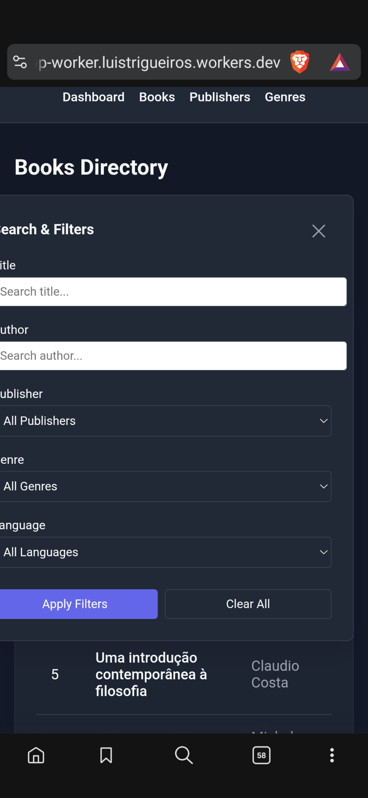

The image should show the way the Filter selection dialog is currently displayed in mobile devices.
It's being clipped of the left side of the screen, not allowing the user to view the wording in the dialog, add spacing on the left side of the dialog to allow the user to see the full text.